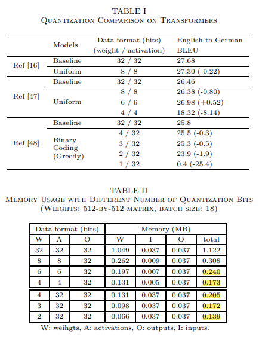

## 2020-12-31

# Extremely Low Bit Transformer Quantization for On-Device Neural Machine Translation
## 기존 METHOD의 GRANUALITY 개선
- 기존 method의 러프함을 어떻게 찾는가
  - Uniform Quantization <-> Non-uniform Quantization
    - Non-uniformity의 기준?
      - Vertically : Layer-wise(Hessian...), Module-wise(FFN, MHSA, EMB)
      - Horizontally : Quantize Embedding by Frequency(!)
- HW-friendly structure
  - Decoder의 AR 속성에 의한 Memory Wall 문제
- Arithmetic 강점을 이용하기 위해, weight, activation 모두가 Quantize되어야 함: Redundant regulation?
- Non-uniform Quantization은 HW 관점에서 어떻게 좋은가?
  - Memory Wall Problem 줄이기
  - __binary-code based quantization__(공부할 것)으로 binary quantization의 이점을 유지

# ALTERNATING MULTI-BIT QUANTIZATION FOR RECURRENT NEURAL NETWORKS
# Network Sketching: Exploiting Binary Structure in Deep CNNs

- __binary-code based quantization__ 부분 발췌

# BiQGEMM: Matrix Multiplication with Lookup Table For Binary-Coding-based Quantized DNNs
